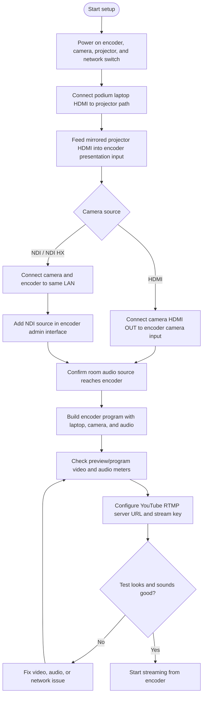
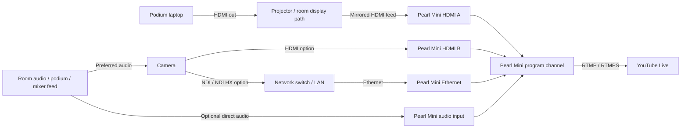

# AV Setup Checklist

Use this guide to connect a podium laptop, camera, room audio, and network stream through a hardware encoder for a YouTube Live event.

This checklist uses the Epiphan Pearl Mini as the example encoder device. The same workflow can apply to any similar encoder or production device that accepts presentation video, camera video, audio, and an Internet connection for streaming.

## Setup workflow

## Physical connections

### Podium laptop

- Connect the laptop HDMI output to the room projector path.
- Feed the projector mirror output into the encoder presentation input, such as **Pearl Mini HDMI A**.
- If needed, configure the laptop display mode so the room screen and encoder receive the presentation feed.
- Do not rely on laptop HDMI audio alone unless it has been tested. Prefer the room audio, camera audio, or mixer feed described below.

### Camera

Use an OBSBOT or other camera, and choose one camera path for video: HDMI or NDI.

**HDMI option**

- Connect **Camera HDMI OUT** to the encoder camera input, such as **Pearl Mini HDMI B**.
- If the camera receives the room or podium audio feed, use that audio source in the encoder channel to keep audio and video in sync.

**NDI / NDI HX option**

- Connect the camera to the same Ethernet switch or LAN as the encoder.
- Enable NDI or NDI HX on the camera.
- Confirm the camera and encoder are on compatible IP network settings.
- In the encoder admin interface, add the NDI source as a network video source.
- If the camera receives the room or podium audio feed, use that audio source in the encoder channel to keep audio and video in sync.

### Room audio

- Preferred: send the podium or mixer audio feed into the camera or directly into the encoder.
- If the presenter computer audio is part of the program, confirm it is embedded in the projector feed and selected in the encoder channel audio settings.
- Optional: use a camera microphone for room sound only if it has been tested in the room.
- During setup, speak at the podium and confirm the encoder audio meters move at a healthy level without clipping.

### Network and streaming

- Connect the encoder Ethernet port to a network switch or router with Internet access.
- Use DHCP unless the venue requires a static IP address.
- In YouTube Studio, create or open the live event.
- Copy the RTMP or RTMPS server URL and stream key into the encoder streaming settings.
- Keep the stream key private.

### Monitoring

- Optional: connect the encoder program output, such as **Pearl Mini HDMI OUT**, to a confidence monitor in the control area.
- Use the encoder front-panel screen or web interface to monitor program output, switch layouts, and check audio levels.
- Use the OBSBOT app, when applicable, to monitor and control the camera.

## Wiring diagram

## Encoder configuration checklist

- Create a program channel.
- Add the laptop or presentation source, such as **HDMI A** on the Pearl Mini.
- Add the camera source:
  - **HDMI B** for a wired camera connection.
  - **NDI / NDI HX** for a network camera connection.
- Select the correct audio source in the channel audio settings, usually the camera, room mixer, or external audio feed.
- Create the needed layouts, such as:
  - Full-screen laptop.
  - Full-screen camera.
  - Picture-in-picture with laptop and camera.
- Confirm preview/program output on the encoder screen or web interface.
- Confirm audio meters respond to real speech and do not clip.
- Configure the YouTube RTMP or RTMPS output.
- Start a private or unlisted test stream before the live event when possible.

## Pre-live checklist

- Laptop presentation is visible on the projector and encoder.
- Camera image is framed, focused, and visible in the encoder program.
- Correct audio source is selected.
- Audio meters show healthy signal during podium speech.
- Encoder has Internet access.
- YouTube stream settings are entered and saved.
- YouTube Studio receives the test stream.
- Confidence monitor or encoder screen shows the expected program output.
- Operator knows which layouts to switch during the event.
